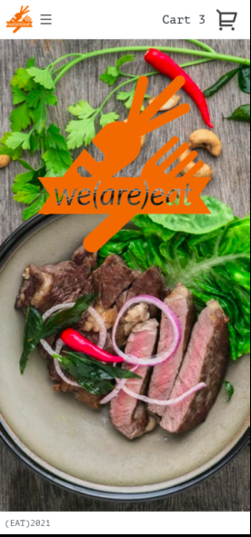
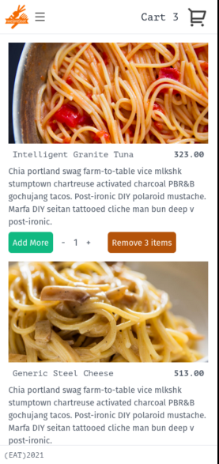
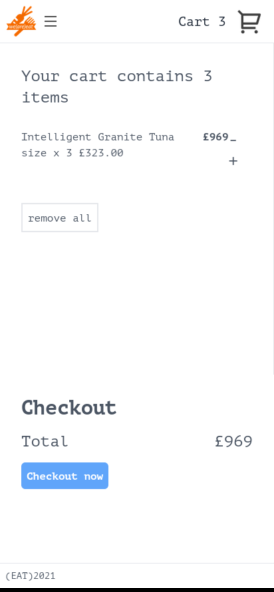
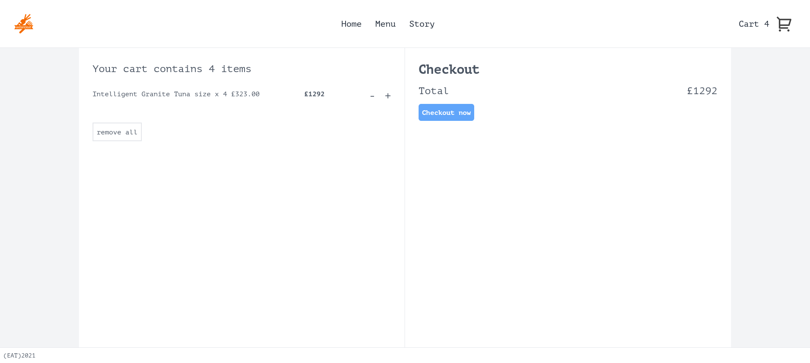

# Mock Storefront

**Author** David Williams

**Date** August 2021

**Last Updated** Febuary 2022

## About

The aim of this project was to learn the basics of Typescript and state management in React using MobX. I wanted to build an app of medium complexity which utilizes a mock API to call on for fetching data, and using a shopping/ store paradigm seemed like a great way to do this. I also had some fun designing and making logos for this dummy company.

**To Do**

-   Checkout form and validation

## Technologies

**HTML**, **Tailwind CSS**, **Javascript**, **React**, **MobX**

## Credits / Attributions

-   (mockend)[https://mockapi.io/] for mocking product data
-   (foodish)[https://foodish-api.herokuapp.com/] for placeholder food images
-   The (dev.to)[https://dev.to/] community for all of the useful articles and tips!

## Screenshots

### Mobile

### Desktop

